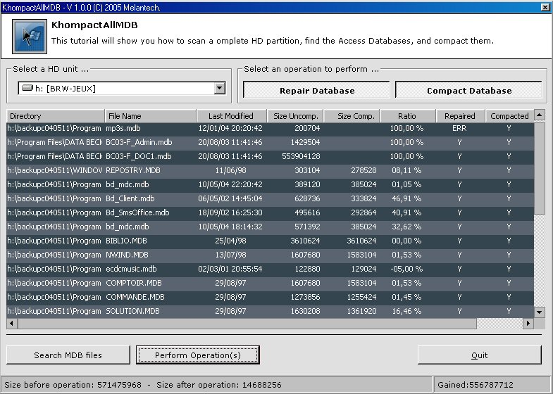



## Compact All MDB

### Description

Tired of seeking through your hard rives to find Access databases, to compact

them and gain some free space?

Then this tool could help you.

Basically it parses all the directories and sub-directories of a given hard drive

unit, and tries to find Access Databases.

When this operation is done, you can repair or compact them. I gained on one

of my HD unit over 6Gb of data.

What you need to make this project work:

vbalSGrid6.ocx and ssubtmr6.dll fro vbAccelerator. These files should

be in the libs directory. If ever they had been removed then, just

go to this url:

http://www.vbaccelerator.com/home/VB/Code/Controls/S_Grid_2/S_Grid_2/VB6_SGrid_2_Binary.asp

1- Open a blank project.

2- Goto to project -> references and select ssubtmr6.dll, it should register it

for you.

3- Open your the test project (an error should appear), then goto

project, components, and select the vbalSGrid6.ocx

4- close the test project.

5- restart it it should be ok.

You'll also need Microsoft DAO 3.51 or 3.6 (depending on the Access version

installed on your computer). Generally 3.51 works well with Ms Office 97 databases

3.6 or above should suit best to newer versions of Access. I'm currently using

Ms Office PRO 97, and thus for referenced DAO 3.51.

If you have troubles or do not understand how to make this thing work,

don't hesitate to send me an email.
 
### More Info
 

             |
---                |---
**Submitted On**   |2005-01-16 19:24:52
**By**             |[brainwasher](https://github.com/Planet-Source-Code/PSCIndex/blob/master/ByAuthor/brainwasher.md)
**Level**          |Advanced
**User Rating**    |5.0 (10 globes from 2 users)
**Compatibility**  |VB 6\.0
**Category**       |[Databases/ Data Access/ DAO/ ADO](https://github.com/Planet-Source-Code/PSCIndex/blob/master/ByCategory/databases-data-access-dao-ado__1-6.md)
**World**          |[Visual Basic](https://github.com/Planet-Source-Code/PSCIndex/blob/master/ByWorld/visual-basic.md)
**Archive File**   |[Compact\_Al1841711192005\.zip](https://github.com/Planet-Source-Code/brainwasher-compact-all-mdb__1-58374/archive/master.zip)

